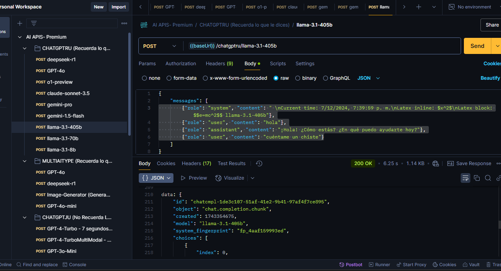

# API Cognitive Services with EvoCortexAI

<p align="center">
  <a href="https://evocortexai.netlify.app/"></a>
</p>


## How does the evocartexAI platform work?

EvoCortexAI provides advanced artificial intelligence cognitive services through a comprehensive API platform. Our suite of AI services includes natural language processing, computer vision, and machine learning capabilities that can be seamlessly integrated into your applications.

## Installation

First, you need to register on the EvoCortexAI platform and obtain your API token. Visit the official website:  [EvocortexAI](https://evocortexai.netlify.app/)

After registration, you'll receive your unique authentication token that will be required for all API calls to our services.

## Demo


## Example API Request with Python

Once registered on the platform, copy your token and use it in your API requests as shown below:

```python
# pip install requests
import requests                                        
url = 'https://significant-rochette-matichelo11-a523eeea.koyeb.app/multiaitype/GPT-4o'
payload = {
    "messages": [
        {"role": "system", "content": " \nCurrent time: 7/12/2024, 7:39:59 p. m.\nLatex inline: $x^2$\nLatex block: $$e=mc^2$$"},
        {"role": "user", "content": "habla todo en español"},
        {"role": "assistant", "content": "¡Hola! ¿Cómo estás? ¿En qué puedo ayudarte hoy?"},
        {"role": "user", "content": "que modelo eres'"}
    ]
}

headers = {
    'x-evocortexai-key': 'YOUR-TOKEN',
    'Content-Type': 'application/json'
}
response = requests.post(url, json=payload, headers=headers)
print(response.text) 
```

You can run the test script to see how it works:

```bash
python test.py
```

# API CHATGPT 4o - Michaell Ibarra

Our ChatGPT-4o API integration provides advanced natural language processing capabilities that you can use to build sophisticated chatbots and conversational AI applications. This powerful language model can understand and generate human-like text, making it ideal for customer service automation, content creation, and interactive user experiences.

## Authentication

To use the Chatgpt AI API, you'll need to include your authentication token in the request headers:

<p align="center">
  
</p>

This authentication process ensures secure access to our AI services while maintaining the integrity of your account and usage limits.


# API Llama AI - Anthony Rojas

Our Llama AI integration provides advanced natural language processing capabilities that you can use to build sophisticated chatbots and conversational AI applications. This powerful language model can understand and generate human-like text.

## Authentication

To use the Llama AI API, you'll need to include your authentication token in the request headers:

<p align="center">
  
</p>

This authentication process ensures secure access to our AI services while maintaining the integrity of your account and usage limits.

<p align="center">
  
</p>

